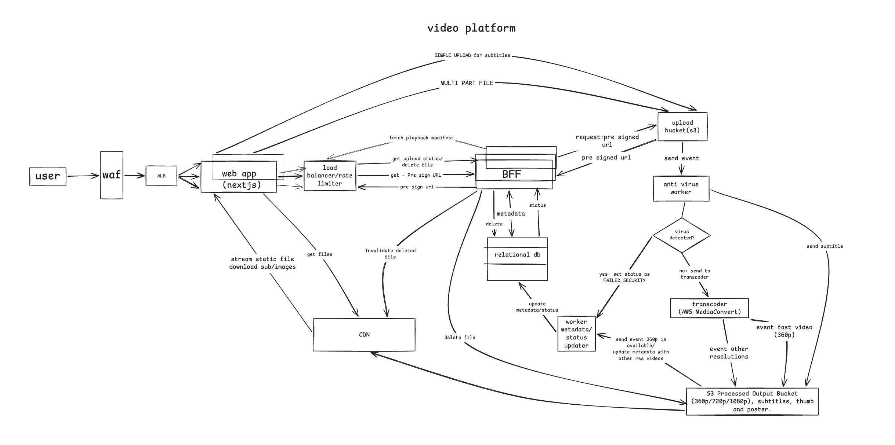

# System Architecture Design: Video Platform



## 1. Architecture Components

*   **WAF (Web Application Firewall):** Protects the application edge against attacks and applies Rate Limiting rules.
*   **ALB (Application Load Balancer):** Distributes web request traffic to the Web App/BFF, handling concurrency spikes with high availability.
*   **Web App:** Client interface. Manages in-memory file chunking, executes parallel uploads, and consumes the Playback Manifest to render the HTML5 video player. Handles MP4, MOV, and WebM file inputs with chunk-level retry and abort logic.
*   **BFF (Backend For Frontend):** Central orchestration point. Generates Pre-signed URLs, and manages initial metadata in the relational DB, staying isolated from heavy media traffic. Provides polling endpoint returning the generated `videoId`.
*   **Upload Bucket (S3):** Quarantine zone. Temporarily stores raw files uploaded by users.
*   **Anti-Virus Worker:** Event-driven service that acts as a strict security gatekeeper. It applies the fail-fast pattern, scanning for infections and discarding malicious files before consuming processing resources.
*   **Transcoder (AWS MediaConvert):** Outsourced processing engine. Responsible for generating multiple resolutions and extracting images (posters and sprites).
*   **S3 Processed Output Bucket:** Immutable and final storage for validated videos, subtitles, and images.
*   **Worker Metadata/Status Updater:** Listener for native infrastructure events (`ObjectCreated`). Extracts technical metadata (duration, dimensions) and asynchronously updates the database as soon as files are physically available.
*   **CDN (Content Delivery Network):** Global content delivery edge. Intercepts and serves massive viewer traffic through cache.

---

## 2. Flows Description

*   **Upload Flow:** The Next.js client requests Pre-signed URLs from the BFF for a Multipart Upload. The BFF creates the initial database record with basic metadata (ID, filename, user) and status `PENDING`. The client then uploads chunks directly to the S3 Upload Bucket, bypassing the backend to save bandwidth. 
*   **Security Gatekeeper Flow:** The S3 `ObjectCreated` event triggers the Anti-Virus Worker. The worker applies the Fail-Fast pattern (virus scan). If clean, it dispatches a transcoding job to AWS MediaConvert and deletes the raw file from the temporary bucket.
*   **Progressive State & Metadata Sync:** Once MediaConvert finishes generating the fast preview version (360p), it lands in the S3 Processed Output Bucket. This triggers the Worker Metadata/Status Updater, which extracts technical metadata (duration, dimensions) and updates the DB status to `PARTIAL_READY` (enabling playback ≤ 15s). A second event triggers when the remaining resolutions (720p/1080p) are completed, updating the DB status to `READY`.
*   **Playback Flow:** The client polls the BFF. Once at least the preview is ready, it fetches the Playback Manifest JSON. The HTML5 player then uses HTTP Byte-Range requests to fetch the video directly from the CDN edge.
*   **Deletion Flow:** The user triggers a delete action. The BFF immediately removes the database record, purges the objects from the S3 Processed Bucket, and issues an active Cache Invalidation request to the CDN to meet the ≤60s SLA.

---

## 3. Entities

### 3.1. DB

**Table: `Video`**
*   `id` (UUID, Primary Key)
*   `user_id` (UUID, Foreign Key) - *Created by BFF*
*   `original_filename` (String) - *Created by BFF*
*   `status` (Enum) - *[PENDING, PROCESSING, PARTIAL_READY, READY, FAILED, FAILED_SECURITY]*
*   `duration_seconds` (Integer) - *Populated by Worker Metadata/Status Updater*
*   `dimensions` (String, e.g., "1920x1080") - *Populated by Worker Metadata/Status Updater*
*   `has_captions` (Boolean) - *Defaults to false*
*   `created_at` (Timestamp)
*   `updated_at` (Timestamp)

### 3.2. S3 Object Storage Structure

**Upload Bucket (Temporary / Quarantine)**
*   `/{videoId}/raw_video.mp4` *(Generated by: Next.js Client via Multipart Upload)*
*   `/{videoId}/raw_captions.vtt` *(Generated by: Next.js Client via Simple Upload)*

**Processed Output Bucket (Final / CDN Origin)**
*   `/{videoId}/360p.mp4` *(Generated by: AWS MediaConvert - Fast preview)*
*   `/{videoId}/720p.mp4` *(Generated by: AWS MediaConvert)*
*   `/{videoId}/1080p.mp4` *(Generated by: AWS MediaConvert)*
*   `/{videoId}/poster.jpg` *(Generated by: AWS MediaConvert - Static thumbnail)*
*   `/{videoId}/sprite.jpg` *(Generated by: AWS MediaConvert - Trick-play image)*
*   `/{videoId}/sprite_map.vtt` *(Generated by: AWS MediaConvert - Trick-play coordinates)*
*   `/{videoId}/captions.vtt` *(Generated by: Anti-Virus Worker - Moved from Quarantine if clean)*

---

## 4. API Contracts

The REST API is designed to be lightweight, delegating heavy payload transfers to S3.

**4.1. Initialize Upload**
*   **Route:** `POST /api/videos/upload`
*   **Request:** 
    ```json
    { 
      "filename": "video.mp4", 
      "fileSize": 104857600, 
      "hasCaptions": false 
    }
    ```
*   **Response (200 OK):** 
    ```json
    {
      "videoId": "abc-123",
      "videoPresignedUrls": [
        "https://s3.../part1", 
        "https://s3.../part2"
      ],
      "captionsPresignedUrl": null
    }
    ```
    *(Note: `captionsPresignedUrl` is only generated and returned if `hasCaptions` is set to true in the request).*

**4.2. Poll Status**
*   **Route:** `GET /api/videos/{id}/status`
*   **Response (200 OK):** `{ "videoId": "abc-123", "status": "PROCESSING" }`

**4.3. Fetch Playback Manifest**
*   **Route:** `GET /api/videos/{id}/manifest`
*   **Response (200 OK):**
    ```json
    {
      "videoId": "abc-123",
      "status": "READY", 
      "metadata": { "durationSeconds": 605 },
      "poster": "[https://cdn.domain.com/abc-123/poster.jpg](https://cdn.domain.com/abc-123/poster.jpg)",
      "sources": [
        { "resolution": "1080p", "url": "[https://cdn.domain.com/abc-123/1080p.mp4](https://cdn.domain.com/abc-123/1080p.mp4)" },
        { "resolution": "720p", "url": "[https://cdn.domain.com/abc-123/720p.mp4](https://cdn.domain.com/abc-123/720p.mp4)" },
        { "resolution": "360p", "url": "[https://cdn.domain.com/abc-123/360p.mp4](https://cdn.domain.com/abc-123/360p.mp4)" }
      ],
      "trickPlay": {
        "spriteImage": "[https://cdn.domain.com/abc-123/sprite.jpg](https://cdn.domain.com/abc-123/sprite.jpg)",
        "vttMap": "[https://cdn.domain.com/abc-123/sprite_map.vtt](https://cdn.domain.com/abc-123/sprite_map.vtt)"
      },
      "captions": [
        { "language": "en", "label": "English", "url": "[https://cdn.domain.com/abc-123/captions.vtt](https://cdn.domain.com/abc-123/captions.vtt)" }
      ]
    }
    ```

**4.4. Delete Video**
*   **Route:** `DELETE /api/videos/{id}`
*   **Response (204 No Content):** *(Triggers DB, S3, and CDN cache invalidation asynchronously)*

---

## 5. Requirements Checklist

### Functional Requirements & Constraints
*   ~~Support videos up to 1GB / 10 min~~: Met using Multipart Upload directly to S3, chunking the file on the client and sending parallel batches for maximum network efficiency.
*   ~~Video transcoding (360p, 720p, 1080p)~~: Solved by delegating asynchronous processing to AWS MediaConvert, optimizing infrastructure.
*   ~~Thumbnails and Sprite Sheets generation~~: Met natively by MediaConvert's image output settings, including automatic `.vtt` mapping generation.
*   ~~Optional captions served as static files~~: Addressed through a simple upload flow where the Worker just moves the `.vtt` file from the ingest zone to the final storage, without transcoding.
*   ~~Video deletion making links unusable in ≤60s~~: Achieved by designing a BFF route that deletes database records and S3 objects, forcing an immediate active cache invalidation in the CDN.

### Non-Functional Requirements (Scale & Performance)
*   ~~500 concurrent uploads and 20k uploads/day~~: Supported by the Application Load Balancer and network decoupling via Pre-signed URLs, shifting bandwidth load to the Object Storage.
*   ~~5,000 concurrent viewers~~: Met by relying 100% on the CDN for distribution, completely isolating the internal system from playback traffic.
*   ~~Robust virus scanning~~: Achieved by establishing the security Worker as the main gatekeeper, processing files as soon as they hit the Upload Bucket.
*   ~~Playback start time ≤ 2.0s P95~~: Guaranteed by combining native CDN HTTP Byte-Range requests and MediaConvert's Fast Start setting, which places the structural index (`moov atom`) at the header of the `.mp4` file.
